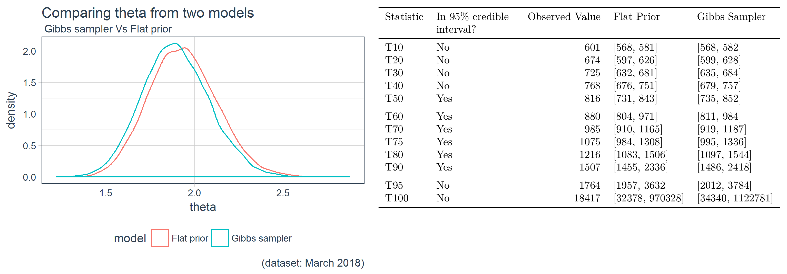
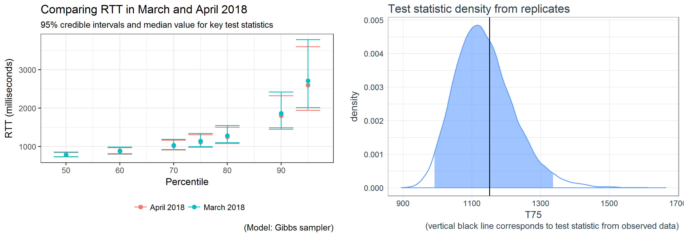
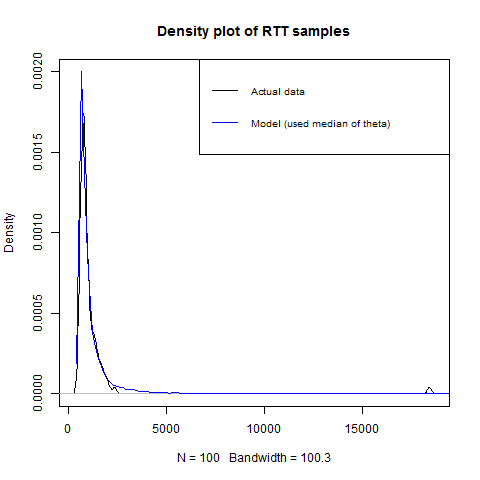

  
  ```{r setup, include=FALSE}
knitr::opts_chunk$set(echo = TRUE)
library(dplyr)
library(ggplot2)
library(tidyverse)
library(tidyr)
library(stringi)
library(lubridate)
library(futile.logger)
library(psych)
library(tibbletime)
library(plotly)
library(viridis)
library(scales)
library(tidyquant)
library(VGAM)
library(MCMCpack)
library(mcmcplots)
library(knitr)
library(kableExtra)
library(gridExtra)
library(grid)
library(png)
```

## 1 Introduction

Latency is a key metric for network performance especially during periods of congestion. One of the measures of network latency is round trip time (RTT) which is defined as the length of time it takes for a data packet to be sent from a sender on one side of the link to a receiver on the other side and its acknowledgement to be received back by the sender. A larger RTT generally implies that the network might be congested or there may be other anomalies. 

We collected RTT measurements from a communication network for a two month period (March-April 2018) and studied their distribution. Data is split into two datasets, a training dataset corresponding to data from March 2018 and a test dataset corresponding to data from April 2018. All RTT meansurments are in milliseconds and correspond to a 40 byte packet. 

There were two main objectives of this study as listed below.

1. Determine if the RTT measurements could be modelled as a well known distribution (see Figure 1) and if so use the draws from the posterior of the model parameters to make inferences on key test statistics (such as the 75th percentile of the RTT which would represent the upper bound on the RTT for 75% of the traffic).

2. Use the draws from the posterior of the model parameters to make inferences about new data collected in the future without having to collect large amount of data. Answer questions such as "is the network more congested now than it was last month?", "has the 75th percentile of the RTT increased?". Any change in the inferences about new data as compared to the original data could then be viewed in context of either endogenous factors (such as upgrade of a key network component) or exogenous factors (such as huge subscriber growth) or a combination thereof.

The data was modelled using the Pareto Type I distribution first using a flat prior for the scale parameter and then using a (Gamma) conjugate prior. Gibbs sampler was used to sample from the full conditional distribution for the scale parameter and the hyperparameter used for the conjugate prior.

The remainder of this analysis is organized as follows: Section 2 discusses the methods used; Section 3 describes the results from the analyses; and Section 4 discusses the overall results and next steps for analysis. Appendix A includes full derivations and Appendix B contains all R code used in this study and finally Appendix C contains some additional results (convergence diagnostics).

## 2 Methods

The raw data collected from the network is cleaned to create a dataset consisting of four features, namely *timestamp, packet size, sequence number and RTT*. This study only makes use of the RTT feature. A random sample of 5 rows from the clean training data is provided in the following table.

```{r echo=F}
bytes   <- 40
pattern <- "train"
fname   <- file.path("output", paste0(pattern, "_ping_", bytes, "_sample.csv"))
df_sample <- read.csv(fname)
kable(df_sample, caption = "Sample data from training dataset (March 2018)",
      col.names = c("Timestamp", "RTT (milliseconds)", "Packet Size (bytes)", "Sequence Number"))
```

The density plot of the RTT (Figure 1) indicates that the RTT measurements correspond to a long tailed distribution where most of the mass is contained within the 500ms to 1500ms interval and there are some measurements in the 15,000ms to 20,000ms range. We model a low-resolution version of this density created by taking percentiles 1,2,3,..,100. A low-resolution version is used because this allows better modeling of future data where we may not have the ability to collect large amounts of data as was done for this study.

A density plot of both the original data and its low-resolution version is presented in Figure 1, expectedly, both plots look very similar (although note that the scale on the Y-axis is different for both the graphs). The original dataset has close to 3 million observations and the low resolution version has just 100 data points representing the percentiles from the original dataset.


A Pareto Type I distribution is used to model the (low-resolution version) of RTT measurement data. The scale parameter is fixed at the minimum RTT value seen in the dataset and the shape parameter is modelled by using a flat prior and also by using a Gamma conjugate. Unless stated otherwise the term dataset refers to the low-resolution equivalent of the original dataset. A pareto Type 1 density can be written as follows: $p(r_i) = \frac{\theta}{r_m}\left(\frac{r_m}{r_i}\right)^{\theta+1}$
  
  Here $r_i$ the represents the observations $r_1,r_2,..r_N$ from the dataset (N=100) and $r_m$ represents the shape parameter of the Pareto and finally $R$ represents the entire dataset. 

### Modeling using the flat prior
We use a flat prior $\pi(\theta) \propto 1$ and write the posterior of the scale parameter $\theta$ as $\theta|R,r_m \sim Gamma(N+1, \sum_{i=1}^{N}log(\frac{r_i}{r_m}))$. We draw 20,000 samples from the posterior distribution of $\theta$ and then for each draw of the $\theta$ we create 20,000 replicates $R^{{rep}(1)}, R^{{rep}(2)},..,R^{{rep}(2000)}$ using the same $r_m$. From each replicate $R^{{rep}(i)}$ we determine several test statistics $T_{10}, T_{20},..,T_{100}$, these test statistics represent the deciles of the replicate. We create a distribution of the test statistics and determine the 95% credible interval and compare with the same test statistics calculated from the observed dataset to determine the posterior predictive probability and credible intervals.

### Modeling using a Gamma conjugate
We use a Gamma prior $\theta \sim Gamma(\alpha, \beta)$ where $\alpha$ is known and $\beta \sim Gamma(a,b)$. The hyper parameters $\alpha, \hspace{1mm}a, \hspace{1mm}b$ are determined by trial and error to get a good fit for the data. 

The full conditional posteriors of $\theta$ and $\beta$ are both recognizable as the kernels of a Gamma distribution. Using a Gibbs Sampler, and given starting values of $\theta^{(0)}$ and $\beta^{(0)}$, we obtain draws from the posterior by iterating between draws of

1. $\theta^{(t)}|\alpha,\beta^{(t-1)},a,b \sim Gamma(n+\alpha, \left(\sum_{i=1}^{N}log(\frac{r_i}{r_m})\right) + \beta^{(t-1)})$  

2. $\beta^{(t)}|\alpha,\theta^{(t-1)},a,b \sim Gamma(a+\alpha, b+\theta^{(t-1)})$
  
We use four different starting point for $\beta^{0}$, combine the four chains after a 50% burn-in and thining (we keep every 5th draw). Once we have drawn 20,000 samples (after burn-in and thining), we evaluate the model parameters using the graphical summaries and posterior predictive distributions of the test statistics $T_{10}, T_{20},..,T_{100}$ in the same way we did for the flat prior. Appendix C provides convergence analysis plots for $\theta$ and $\beta$ and also the Gelman Rubin statistic to test convergence.

### Creating summaries for new data
We use the draws from the posterior distribution of the shape parameter $\theta$ and a new value of $r_m$ as seen from the new data to again create the posterior predictive distributions of the test statistics  $T_{10}, T_{20},..,T_{100}$ to be able to answer questions such as what is the $75^{th}$ percentile RTT value for the new data (for example a single day in April 2018).

We also recreate the model with the new data (April 2018) to determine the 95% credible interval of the test statistics and then observe have the 95% credible intervals shifted.

## Results

**Sensitivty analysis on the training dataset**: A visual comparison (Figure 2) of the posterior densities obtained using the flat prior and the Gibbs sampler using the conjugate prior indicate very little difference between the posteriors. Table 2 presents the median and the 95% credible interval for $\theta$ under both the models.

```{r echo=FALSE, fig.cap="Sensitivity Analysis (March 2018 dataset)", out.width = '82%'}

pattern <- "train"
bytes <- 40
fname = file.path("output", "posterior", paste0(pattern, "_", bytes, "b_theta_sensitivity.csv"))
theta_summary <- read.csv(fname)
kable(theta_summary[, c("model", "point_estimate", "CI")], col.names = c("Model", "Median", "95% credible interval"), caption = "Sensitivity analysis for theta")


```

The posterior predictive p-value of the test statistics $T_{10}, T_{20},..,,T_{100}$ are presented in the Figure 2 (see table for test statistics). For both models we notice that the observed  $T_{10},..,T_{40}$ are outside of the 95% credible intervals, but $T_{50}, T_{60}, T_{70},T_{75}, T_{80}, T_{90}$ are in the 95% credible interval. 

**Model comparison between two different datasets**: We compare the credible interval for the key test statistics $T_{50}, T_{60}, T_{70},T_{75}, T_{80}, T_{90}$ as provided by the Gibbs sampler model for the data from the month of March and the data for the month of April. Figure 3 provides the comparison. We can see from the plot that the credible interval have shifted towards slightly smaller RTT values. We determine $r_m$ from the RTT values collected on a random day in April (test dataset) and combine with the $\theta$ draws from the posterior (Gibbs sampler) from the training data to create posterior summaries. The $T_{75}$ test statistics still exists within the 95% credible interval as shown in the density plot in Figure 3.  

## Discussion
The sensitivity analysis indicates that there is little to choose from between the flat prior model and the Gibbs sampler with conjugate prior since the results for the test statistics are identical (in terms of which statistics fall within the 95% credible interval).

Also, the models fits only about half the density. However, the portion of the density that the models do fit are the more important portions as we are more interested in making inferences about a larger percentage of the data i.e. being able to draw inference about say the upper bound on the RTT value for 75% of the traffic is more useful than being able to draw inference on say the 10% percent of the traffic that experienced much (better) smaller RTT. 

As seen in this figure 3, the credible interval for the month of April seems to have shifted towards slightly smaller RTT values indicating that for this network there was some change which resulted in network traffic experiencing smaller latencies. A network operator familiar with this particular network should be able to attribute this reduction in latency values to some endogenous and/or exogenous factor.

```{r echo=FALSE, fig.cap="Model comparison, March 2018 and April 2018 datasets", out.width = '100%'}

```

## References

[1] Bayesian Estimation and Prediction for Pareto Data. https://www.jstor.org/stable/2290086

[2] Single parameter Pareto. https://www.casact.org/pubs/proceed/proceed94/94114.pdf

[3] Exponential lomax distribution. https://pdfs.semanticscholar.org/0f3d/763a15e291d366423043e42653c5072c219e.pdf

[4] Bayesian  Analysis  of  Lomax  Distribution  under  Asymmetric Loss Functions. https://www.researchgate.net/publication/313500265_Bayesian_Analysis_of_Lomax_Distribution_under_Asymmetric_Loss_Functions

## Appendix A: Derivations

### Posterior using flat prior
The Pareto Likelihood can be written as

$$\mathcal{L}(R|r_{m},\theta) = \prod_{i=1}^{N}\frac{\theta}{r_m}\left(\frac{r_m}{r_i}\right)^{\theta+1}$$
  The posterior for $\theta$ using a flat prior $\pi(\theta) \propto 1$ is

$$p(\theta|R,r_m) \propto \prod_{i=1}^{N}\frac{\theta}{r_m}\left(\frac{r_m}{r_i}\right)^{\theta+1} \times 1 $$
  
  $$=\theta^{N}r_m^{N\theta}\hspace{1mm}r_{i}^{-(\theta+1)}$$
  $$=\theta^{N}exp[log(r_m^{N\theta})]\hspace{1mm}exp[\sum_{i=1}^{N}log(r_{i}^{-(\theta+1)})]$$
  
  $$=\theta^{N}exp[\sum_{i=1}^{N}log(r_m^{\theta})]\hspace{1mm}exp[\sum_{i=1}^{N}log(r_{i}^{-(\theta)})]exp[log(r_{i}^{-(1)})]$$
  Ignoring the $exp[log(r_i^{-1})]$ since it only depends upon the data $r_i$
  
  $$=\theta^{N}exp[\sum_{i=1}^{N}log(r_m^{\theta})]\hspace{1mm}exp[\sum_{i=1}^{N}log(r_{i}^{-(\theta)})]$$
  $$=\theta^{N}exp[\theta \sum_{i=1}^{N}log(r_m)]\hspace{1mm}exp[-\theta\sum_{i=1}^{N}log(r_{i})]$$
  $$=\theta^{N}exp[-\theta \sum_{i=1}^{N}log(\frac{r_i}{r_m})]$$
  
  We can recognize this as a kernel of the Gamma distribution with parameters $(N+1, \sum_{i=1}^{N}log(\frac{r_i}{r_m}))$. Thus we can write the posterior distribtion as 

$\theta|R,r_m \sim Gamma(N+1, \sum_{i=1}^{N}log(\frac{r_i}{r_m}))$
  
### Posterior using a Gamma conjugate with hyper-parameters
  
  We can define a Gamma conjugate for $\theta$ as $\theta \sim Gamma(\alpha, \beta)$ where $\alpha$ is known and $\beta$ comes from another Gamma distribution defined as $\beta \sim Gamma(a,b)$ where $a, b$ are known.

We can then write the full posterior as (using results from the derivation of the posterior using the flat prior)

$p(\theta,\beta|R) = \mathcal{L}(R|\theta,\beta) \times \pi(\theta|\beta) \times \pi(\beta)$
  $=\theta^{N}exp[-\theta \sum_{i=1}^{N}log(\frac{r_i}{r_m})]\frac{\beta^\alpha}{\Gamma(\alpha)}\theta^{\alpha-1}exp[-\beta\theta]\frac{b^{a}}{\Gamma(a)}\beta^{a-1}exp[-b\beta]$
  
  $\propto \theta^{N}exp[-\theta \sum_{i=1}^{N}log(\frac{r_i}{r_m})]\frac{\beta^\alpha}{\Gamma(\alpha)}\theta^{\alpha-1}exp[-\beta\theta]\beta^{a-1}exp[-b\beta]$
  
  $\propto \theta^{(N+\alpha)-1}exp[-\theta \left(\left(\sum_{i=1}^{N}log(\frac{r_i}{r_m})\right)+\beta\right)]\frac{\beta^\alpha}{\Gamma(\alpha)}\beta^{a-1}exp[-b\beta]$
  
  The above equation represents the full posterior. We can use this to determine the full conditionals for $\beta$ and $\theta$
  
  First we determine the full conditional for $\theta$, so considering everything except $\theta$ as known we get

$p(\theta|R, r_m, \beta) \propto \theta^{(N+\alpha)-1}exp[-\theta \left(\left(\sum_{i=1}^{N}log(\frac{r_i}{r_m})\right)+\beta\right)]$ 
  
  We recognize the above density as the kernel of a Gamma distribution with parameters $(N+\alpha, \left(\sum_{i=1}^{N}log(\frac{r_i}{r_m})\right)+\beta)$
  
  Thus we have that

$\theta|R, r_m, \beta \sim Gamma(N+\alpha, \hspace{1mm} \left(\sum_{i=1}^{N}log(\frac{r_i}{r_m})\right)+\beta)$
  
  Similarly we can determine the full conditional for $\beta$ as follows, considering everything other than $\beta$ as known we get

$p(\beta|R, r_m, \theta) \propto exp[-\theta\beta]\beta^\alpha\beta^{a-1}exp[-b\beta]$
  $=\beta^{(\alpha+a)-1}exp[-(\theta+b)\beta]$
  
  We recognize this as the kernel of a Gamma distribution with parameters $(\alpha+a, \hspace{1mm}\theta+b)$
  
  $\beta|R, r_m,\theta \sim Gamma(\alpha+a, \hspace{1mm}\theta+b)$
  
Using a Gibbs Sampler, and given starting values of $\theta^{(0)}$ and $\beta^{(0)}$, we obtain draws from the posterior by iterating between draws of

1. $\theta^{(t)}|\alpha,\beta^{(t-1)},a,b \sim Gamma(n+\alpha, \left(\sum_{i=1}^{N}log(\frac{r_i}{r_m})\right) + \beta^{(t-1)})$
  
2. $\beta^{(t)}|\alpha,\theta^{(t-1)},a,b \sim Gamma(a+\alpha, b+\theta^{(t-1)})$
  
## Appendix B: Code
  
All code for this paper is available in the Github repo https://github.com/aarora79/rttmodelR. The model.R file which deals with all the Bayesian analysis of the clean dataset is being presented here.
```{r eval=F}
#include code from other modules
source("src/globals.R")

set.seed(20092013)

draw_density_plot_with_ci <- function(x, v, q) {
  d <- as.data.frame(x=x)
  
  p <- ggplot(data=d) +
    theme_tq() + 
    geom_density(aes(x=x, y = ..density..), color = '#619CFF') +
    labs(x = paste0("T", as.integer(100*q)),
         title = "Test statistic density from replicates",
         caption="(vertical black line corresponds to test statistic from observed data)")
  
  # new code is below
  q2.3  <- quantile(x, .023) # 2 Std 95.4%
  q97.7 <- quantile(x, .977)
  
  x.dens  <- density(x)
  df.dens <- data.frame(x=x.dens$x, y=x.dens$y)
  
  p + 
    geom_area(data = subset(df.dens, x >= q2.3 & x <= q97.7), # 2 Std 95.4%
              aes(x=x,y=y), fill='#619CFF', alpha=0.6) +
    geom_vline(xintercept=v, show_guide=T)
}

eval_model <- function(q, B, scale, shape, r, pattern, bytes, dataset, model) {
  set.seed(20092013)

  flog.info("going to run eval_model for scale %.2f, shape %.2f, q %.2f\n", scale, shape, q)
  start_time <- Sys.time()
  
  get_T <- function(x) {
    y = rparetoI(B, scale, x)
    quantile(y, q)
  }
  test_stat = unlist(map(shape, get_T))
  v <- r[as.integer(100*q)]
  
  p = draw_density_plot_with_ci(test_stat, v, q)
  p
  ggsave(file.path("plots", paste0(pattern, "_", bytes, "_byte_T",as.integer(100*q), "density.png")))
  
  plot(density(test_stat))
  p_val <- mean(test_stat > v)
  
  cat(sprintf("posterior predictive p-value of observed test statistic %.4f\n", p_val))
  
  abline(v=v, col='blue')
  
  ci = quantile(test_stat, c(0.025, 0.975))
  ci <- round(ci)
  
  cat(sprintf("95%% confidence interval for test statistic is [%.2f, %.2f]\n", ci[1],ci[2]))
  if(v >= ci[1] & v <= ci[2]) {
    in_ci = "Yes"
    cat(sprintf("%f quantile for observed data is %.2f which is within the credible interval [%.2f, %.2f]\n", q, v, ci[1],ci[2]))
  } else {
    in_ci = "No"
    cat(sprintf("%f quantile for observed data is %.2f which is NOT within the credible interval [%.2f, %.2f]\n", q, v, ci[1],ci[2]))
  }
  end_time <- Sys.time()
  flog.info("eval_model took %.2f seconds", difftime(end_time, start_time, units="secs"))
  
  data.frame(q=q, v=v, median_test_stat=median(test_stat), 
             mean_test_stat=mean(test_stat),
             CI_L=ci[1], CI_U=ci[2],
             CI=paste0("[", ci[1], ", ", ci[2], "]"), CI_size=as.integer(ci[2]-ci[1]),
             p_val=p_val, in_ci = in_ci, dataset=dataset, model=model)
}

run_gibbs_sampler <- function(r, 
                              ts = 1,
                              #alpha = 10,
                              #bs = 5,
                              alpha = 3,
                              bs = 1,
                              a = 1,
                              b = 0.001, 
                              B = 50000,
                              burn_in = 0.5, 
                              thin = 5) {
  flog.info("params used ->\n")
  flog.info("ts %.2f, alpha %.2f, bs %.2f, a %.2f, b %.2f, B %d, burn_in %.2f, thin %d\n",
            ts, alpha, bs, a, b, B, burn_in, thin)
  n <- length(r)
  flog.info(" n %d, min value in data %.2f\n", n, min(r))
  
  theta	<- vector(length = B)
  beta	<- vector(length = B)
  
  theta[1] <- ts
  beta[1]  <- bs
  
  s_l_r_rm <- sum(log(r/min(r)))
  for(t in 2:B){
    ## update beta ##
    beta[t]  <- rgamma(1, alpha+a, theta[t-1]+b)
    
    ## update theta ##
    theta[t] <- rgamma(1, n+alpha, s_l_r_rm+beta[t-1])
  }
  
  # discard 50% burn-in
  burn_in <- 0.5
  beta = beta[(length(beta)*burn_in):length(beta)]
  i = seq(1: length(beta))
  beta = beta[i[i %% thin == 0]]
  beta_mat           = matrix(beta, ncol = 1)
  colnames(beta_mat) = 'beta'
  beta_list				<- mcmc.list(list(mcmc(beta_mat)))
  suppressWarnings(mcmcplot1(beta_list, greek=T))
  
  # discard 50% burn-in
  theta = theta[(length(theta)*burn_in):length(theta)]
  i = seq(1: length(theta))
  theta = theta[i[i %% thin == 0]]
  theta_mat           = matrix(theta, ncol = 1)
  colnames(theta_mat) = 'theta'
  theta_list				<- mcmc.list(list(mcmc(theta_mat)))
  suppressWarnings(mcmcplot1(theta_list, greek=T))
  
  list(theta=theta, beta=beta)
}

#######################
# read data
#######################
bytes = 40
flog.info("going to use ParetoI model ping dataset for bytes=%d", bytes)
start_time <- Sys.time()

pattern <- "train"
dataset <- "March 2018"
pattern <- "test"
dataset <- "April 2018"
fname = file.path("data", paste0(pattern, "_ping_", bytes, ".csv"))
df = read.csv(fname, stringsAsFactors = F) 
end_time <- Sys.time()
flog.info("time taken for reading ping data for bytes=%d is %.2f seconds", bytes, difftime(end_time, start_time, units="secs"))

# print some random rows from the dataset
df_sample <- sample_n(df, 5)
col_names <- c("timestamp", "RTT (in milliseconds)", "packet size", "sequence number")
colnames(df_sample) <- col_names
fname = file.path("output", paste0(pattern, "_ping_", bytes, "_sample.csv"))
write.csv(df_sample, fname, row.names = F)
kable(df_sample, col.names = col_names)


# make a density plot
par(mfrow=c(1,2))

plot(density(df$rtt), main="Density plot of RTT measurements")


#######################
# wrangle it
#######################
r <- df$rtt[df$rtt>0]
r <- as.numeric(quantile(r, seq(0.01, 1, 0.01)))
# make a density plot
plot(density(r), main="Density plot of low-resolution version of data", col='blue')


dev.copy(png, file.path("plots", paste0(pattern, "_density_rtt.png")))
dev.off()
par(mfrow=c(1,1))


#######################
# plot it
#######################
n <- length(r)
plot(density(r))

#######################
# is pareto a good fit? Try with a flat prior
#######################
flog.info("########################################\n")
flog.info("Adequacy of fit with flat prior")
flog.info("########################################\n")
model <- "Flat prior"
B <- 20000
theta = rgamma(B, n+1, sum(log(r/min(r))))
# save theta for drawing inferences on new data
theta_df = data.frame(theta=theta)
fname = file.path("output", "posterior", paste0(pattern, "_", bytes, "b_theta_from_flat_prior.csv"))
write.csv(theta_df, fname, row.names = F)

q  = c(seq(0.1, 1, 0.1), 0.75, 0.95)
eval_results = map(q, eval_model, B, min(r), theta, r, pattern, bytes, dataset, model) %>%
  reduce(rbind)
fname <- file.path("output", "test_stat", paste0(pattern , "_", bytes, "b_model_fit_flat_prior.csv"))
write.csv(eval_results, fname, row.names = F)


#######################
# run Gibbs sampler
#######################
run1 <- run_gibbs_sampler(r, 1)
run2 <- run_gibbs_sampler(r, 1.5)
run3 <- run_gibbs_sampler(r, 2.5)
run4 <- run_gibbs_sampler(r, 3.0)

allChains <- mcmc.list(list(mcmc(run1$theta),
                            mcmc(run2$theta),
                            mcmc(run3$theta),
                            mcmc(run4$theta))) 
gelman.diag(allChains)

########################
# combine samples for posterior summaries and inference
########################
theta <- c(run1$theta, run2$theta, run3$theta, run4$theta)
theta_mat           = matrix(theta, ncol = 1)
colnames(theta_mat) = 'theta'
theta_list				<- mcmc.list(list(mcmc(theta_mat)))
suppressWarnings(mcmcplot1(theta_list, greek=T))

set.seed(20092013)
par(mfrow=c(1,1))
plot(density(r))
median(theta)
2.4
lines(density(rpareto(10^4, min(r), median(theta))), col='blue')
#lines(density(rpareto(10^4, min(r), 2.5)), col='blue')

########################
# adequacy of fit
########################
flog.info("########################################\n")
flog.info("Adequacy of fit after Gibbs sampling")
flog.info("########################################\n")

B <- 20000
model = "Gibbs sampler"
eval_results = map(q, eval_model, B, min(r), theta, r, pattern, bytes, dataset, model) %>%
  reduce(rbind)
fname <- file.path("output", "test_stat", paste0(pattern, "_", bytes, "b_model_fit_gibbs_sampler.csv"))
write.csv(eval_results, fname, row.names = F)

# save theta for drawing inferences on new data
theta_df = data.frame(theta=theta)
fname = file.path("output", "posterior", paste0(pattern, "_", bytes, "b_theta_from_gibbs_sampler.csv"))
write.csv(theta_df, fname, row.names = F)

#######################
# compare theta from flat prior and Gibbs sampler
#######################
fname = file.path("output", "posterior", paste0(pattern, "_", bytes, "b_theta_from_gibbs_sampler.csv"))
theta_gibbs = read.csv(fname)
theta_gibbs$model = "Gibbs sampler"
theta_gibbs$dataset = dataset

fname = file.path("output", "posterior", paste0(pattern, "_", bytes, "b_theta_from_flat_prior.csv"))
theta_flat_prior = read.csv(fname)
theta_flat_prior$model = "Flat prior"
theta_flat_prior$dataset = dataset

theta = rbind(theta_gibbs, theta_flat_prior)
p <- ggplot(data=theta) +
  theme_tq() + 
  geom_density(aes(x=theta, y = ..density.., col=model)) +
  labs(x = "theta",
       title = "Comparing theta from two models",
       subtitle = " Gibbs sampler Vs Flat prior",
       caption=paste0("(dataset: ", dataset, ")"))
fname = file.path("plots", paste0(pattern, "_", bytes, "b_model_comparison.png"))
ggsave(fname)

# create summary as a table
theta_summary = theta %>%
  group_by(model) %>%
  summarize(q_025 = quantile(theta, c(0.025)),
            q_500 = quantile(theta, c(0.5)),
            q_975 = quantile(theta, c(0.975))) %>%
  mutate(point_estimate = round(q_500, 4), CI = paste0("[", round(q_025, 4), ", ", round(q_975, 4), "]"))
fname = file.path("output", "posterior", paste0(pattern, "_", bytes, "b_theta_sensitivity.csv"))
write.csv(theta_summary, fname, row.names = F)
kable(theta_summary[, c("model", "point_estimate", "CI")], col.names = c("Model", "Median", "95% credible interval"))

#######################
# Compare results
#######################
path <- file.path("output", "test_stat")
files <- file.path(path, dir(path=path, pattern = "^(test|train)"))
results <- files %>%
  map(read.csv, stringsAsFactors = F) %>%    # read in all the files individually
  reduce(rbind)        # reduce with rbind into one dataframe

# sensitivity analysis
dataset <-"March 2018"
results_train = results[results$dataset == dataset, c("q", "model", "CI", "in_ci")]
## this works only because in_ci value happens to be same for both models!!!
results_spread = spread(results_train, model, CI) %>%
  mutate(q = paste0("T", as.integer(100*q)))
fname = file.path("output", "sensitivity", paste0(dataset, "_", bytes, "b_flat_vs_Gibbs.csv"))
write.csv(results_spread, fname)
x = kable(results_spread, col.names = c("Statistic", "In 95% credible interval?", 
      "Flat Prior", "Gibbs Sampler"), format = "latex", booktabs = T) %>%
  column_spec(2:3, width = "2.5cm")
fname = file.path("plots", paste0(pattern, "_", bytes, "b_model_comparison_credible_interval"))
kable_as_image(x, filename = fname)

m <- "Gibbs sampler"
title <- "Comparing RTT in March and April 2018"

p = results %>%
  filter(model == m) %>%
  filter(q >= 0.5 & q != 1.0) %>%
  ggplot(aes(x = 100*q, y = mean_test_stat, col=dataset)) +
  geom_point(size = 2) +
  geom_errorbar(aes(ymax = CI_U, ymin = CI_L)) + 
  labs(x="Percentile", y="RTT (milliseconds)",
       title=title,
       subtitle="95% credible intervals and median value for key test statistics", 
       caption=paste0("(Model: ", m, ")"),
       col="") +
  theme_bw() + 
  theme(legend.position = "bottom")
p
fname = file.path("plots", paste0("rtt_comparison_two_datasets_", m, ".png"))
ggsave(fname)

###################################
# make inferences about new data using theta from training set
###################################
pattern <- "train"
fname = file.path("output", "posterior", paste0(pattern, "_", bytes, "b_theta_from_gibbs_sampler.csv"))
theta_gibbs = read.csv(fname)
theta = theta_gibbs$theta

pattern <- "test"
dataset <- "April 2018"
fname = file.path("data", paste0(pattern, "_ping_", bytes, ".csv"))
df_test = read.csv(fname, stringsAsFactors = F) 

# lets choose April 13th for testing
r = df_test %>%
  filter(rtt != 0) %>%
  mutate(timestamp = ymd_hms(timestamp)) %>%
  filter(month(timestamp) == 4 & day(timestamp) == 13) %>%
  dplyr::select(rtt)

r <- as.numeric(quantile(r$rtt, seq(0.01, 1, 0.01)))

B       <- 20000
model   <- "Gibbs sampler"
pattern <- "new_data"
dataset <- "april13th"
q = c(0.75, 0.5, 0.6, 0.7, 0.8, 0.9)
eval_results = map(q, eval_model, B, min(r), theta, r, pattern, bytes, dataset, model) %>%
  reduce(rbind)
fname <- file.path("output", "test_stat", paste0(pattern, "_", bytes, "b_model_fit_gibbs_sampler.csv"))
write.csv(eval_results, fname, row.names = F)
```

## Appendix C
This section presents some additional results that were observed but not included in the main paper.

### Model fit
The following plot presents the density of the samples generated from the Pareto Type 1 distribution using a point estimate (median) of $\theta$ obtained from the Gibbs sampler overlayed on top of the density of the original dataset (low-res version).

The density for a sample $r_i$ under this model is given by $p(r_i) = \frac{1.89}{543}\left(\frac{543}{r_i}\right)^{(1.89+1)}$



### Convergence diagnostics for theta

The various convergence plots indicate that the $\theta$ value has converged.

```{r echo=F}
fname = file.path("output", "posterior", paste0(pattern, "_", bytes, "b_theta_from_gibbs_sampler.csv"))
theta = read.csv(fname)
theta_mat           = matrix(theta$theta, ncol = 1)
colnames(theta_mat) = 'theta'
theta_list				<- mcmc.list(list(mcmc(theta_mat)))
suppressWarnings(mcmcplot1(theta_list, greek=T))
```


### Convergence diagnostics for beta

The various convergence plots indicate that the $\beta$ value has converged.

```{r echo=F}
fname = file.path("output", "posterior", paste0(pattern, "_", bytes, "b_beta_from_gibbs_sampler.csv"))
beta = read.csv(fname)
beta_mat           = matrix(beta$beta, ncol = 1)
colnames(beta_mat) = 'beta'
beta_list				<- mcmc.list(list(mcmc(beta_mat)))
suppressWarnings(mcmcplot1(beta_list, greek=T))
```